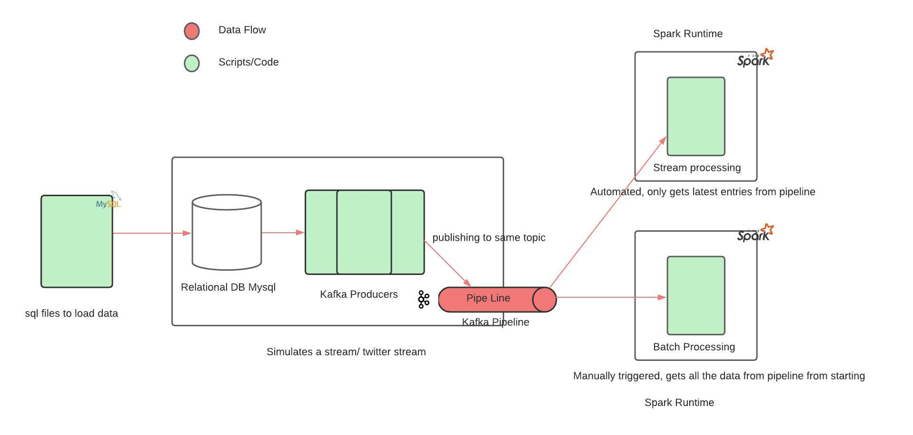

# Big-Data-Analytics-for-Google-Play-Store

## ABSTRACT

The Google Play Store hosts a vast collection of millions of apps that are downloaded and used by billions of users worldwide. When users browse or search for apps, they are presented with a list of options, each displaying the app name and its rating. Typically, users tend to gravitate towards highly rated apps, as they reflect user satisfaction. App developers employ various techniques and optimizations, apart from the inherent app quality, to obtain high ratings. These include using attractive app titles, compelling icons, and other strategies to enhance their app's rating. However, there is currently no scientific approach to determine the actual impact of employing such techniques on achieving higher ratings.

This project uses PySpark and Tableau aims to investigate several factors related to Google Play Store apps and assess their influence using variable importance analysis. To accomplish this, we utilize a real-world dataset obtained from the Google Play Store to identify the significance of these factors. Random Forest, Linear Regression Model, and Support Vector Regression methods are employed to identify important variables. The models' performance is evaluated using standard evaluation techniques. Our findings reveal that certain factors hold greater significance and have a notable impact on app ratings. Additionally, we conduct keyword analysis to identify important words used in app titles that correlate with higher and lower ratings.

----------

# STREAM-BATCH-PROCESSING-KAFKA-SPARK

## SYNOPSIS

This project involves simulating real-time queries through Kafka and performing stream and batch processing using Spark. The architecture follows the lambda architecture, with Kafka as the publisher and Spark for subscribing. Real-time data simulation is achieved through randomized streaming from a database.

## PROBLEM DESCRIPTION AND INTRODUCTION

The project addresses the challenge of processing massive Twitter-generated data. It employs Kafka to create multiple topics (tweets, hashtags, top_tweets, top_hashtags) for publishing MySQL database data. This achieves real-time streaming, simulating Twitter API-like performance. The focus is on efficiently processing real-time data using Apache Spark and Kafka, specifically Twitter feeds, for insightful analysis. Batch processing and topic comparisons are also demonstrated.

## TECHNOLOGIES / FRAMEWORKS TO BE EXERCISED

-   Ubuntu 20.04 or 22.04 or any other LINUX environment
-   Zookeeper
-   Apache Spark Streaming or pyspark

bashCopy code

`pip3 install pyspark` 

-   Apache Kafka Streaming Installation guide: [Click Here](https://linuxhint.com/install-apache-kafka-ubuntu-22-04/)
-   MYSQL Database: Localhost or remote SQL database (recommended) from [DB4FREE](https://www.db4free.net/)

## INSTRUCTIONS

1.  Load the provided Database folder into a MySQL database and name it.
2.  Fill in the dataset details in `kafka_producer.py`:
    -   host="YOUR_HOST_NAME",
    -   user="YOUR_USER_NAME_OF_DATABASE",
    -   password="DATABASE_PASSWORD",
    -   database="DATABASE_NAME"
3.  Start Zookeeper and Kafka in a terminal:

bashCopy code

`sudo systemctl start zookeeper
sudo systemctl start kafka
sudo systemctl status kafka` 

4.  Create Kafka topics:

bashCopy code

`sudo -u "user_username" /opt/kafka/bin/kafka-topics.sh --create --bootstrap-server localhost:9092 --replication-factor 1 --partitions 1 --topic tweets
sudo -u "user_username" /opt/kafka/bin/kafka-topics.sh --create --bootstrap-server localhost:9092 --replication-factor 1 --partitions 1 --topic hashtags
sudo -u "user_username" /opt/kafka/bin/kafka-topics.sh --create --bootstrap-server localhost:9092 --replication-factor 1 --partitions 1 --topic top_tweets
sudo -u "user_username" /opt/kafka/bin/kafka-topics.sh --create --bootstrap-server localhost:9092 --replication-factor 1 --partitions 1 --topic top_hashtags` 

5.  Simulate streaming of tweets using `kafka_producer.py`:

bashCopy code

`python3 kafka_producer.py` 

6.  Subscribe to Kafka topics using Spark for stream processing:

bashCopy code

`spark-submit --packages org.apache.spark:spark-sql-kafka-0-10_2.12:3.2.3 spark_streaming_consumer.py` 

7.  Subscribe to Kafka topics using Spark for batch processing:

bashCopy code

`spark-submit --packages org.apache.spark:spark-sql-kafka-0-10_2.12:3.2.3 spark_batch_consumer.py` 

8.  Both consumer files can run simultaneously.
